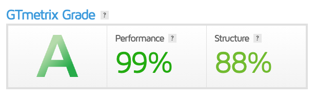
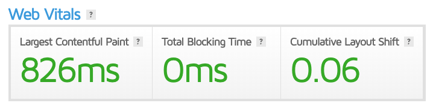

---

backgroundImage: url('sfondo.png')
paginate: true
marp: true
---
# Progetto d'esame
## Manga Commerce
**Alessia Colpo** n° _matricola:823_
Graphic Design
ACME - 3°anno
A.A. 2023-2024
**Materia**:Web Design 2
**Docente**:Matteo Baccan

---
# Manga Fun

Quest'anno abbiamo creato un **sito multi pagina per un e-commerce**. Io ho scelto di progettare un e-commerce di manga, utilizzando le **competenze** acquisite in precedenza su **HTML, CSS e Javascript**.

Il repository è pubblicato a questo indirizzo: https://mangacommerce.netlify.app/

---
# Creazione Slide

Marp conosciuto anche come _Markdown Presentation Ecosystem_ permette un'esperienza intuitiva e veloce per creare delle semplici slide. Quello che noi dobbiamo fare è semplicemente scrivere un documento in **markdown**.

---
# Strumento per la programmazione

Ho usato il _code editor_ **Visual Studio Code**, clonando il mio repository di GitHub localmente, potendo **programmare** tranquillamente **offline** e successivamente aggiornare il mio repository di GitHub

---
# IA e Chat GPT

Ho usato questa IA, _intelligenza artificiale_ per **creare** in parte il **codice** e aiutarmi quando non sapevo come realizzarlo, inoltre mi è stata utile anche per **creare parte dei testi** all'interno del sito

---
# Creazione del sito
---
## Homepage
In alto abbiamo la **navbar** importante per la navigazione all'interno del sito.
Caratteristica rilevante sono gli slider, realizzati usando delle demo di [Swiper](https://swiperjs.com/demos)

---
### Primo Slider:
```html
<div class="swiper mySwiper1">
    <div class="swiper-wrapper">
        <div class="swiper-slide">
            
        </div>
        <div class="swiper-slide">
            
        </div>
        <div class="swiper-slide">
            
        </div>
    </div>
</div>
```
---
Funzione JS
```js
var swiper = new Swiper(".mySwiper1", {
    spaceBetween: 30,
    centeredSlides: true,
    autoplay: {
      delay: 2500,
      disableOnInteraction: false,
    },
    pagination: {
      el: ".swiper-pagination",
      clickable: true,
    },
  });
```
---
### Secondo Slider
I prodotti nella home sono resi **dinamici** grazia a una funzione **JS** che
cicla attraverso un **array di prodotti** e **genera del codice HTML** per ogni prodotto, che viene quindi inserito all'interno di un elemento specifico nel documento HTML.

---
```js
html = "";
products.forEach((product) => {
    html += `
<div class="swiper-slide img">
  <div class="card">
    
    <div class="card-body">
      <a class="nome" href="prodotto.html?p=${product.nome}">
        <p class="nome">${product.nome}</p>
      </a>
      <b>${product.prezzo.toFixed(2)}€</b>
      <br>
      <a class="btn btn-primary">Aggiungi al carrello</a>
    </div>
  </div>
</div>`;
});
document.getElementById("TEST").innerHTML = html;
});
```
---
## Funzioni globali
- Cookie
- Scroll To Top
- Barra di Ricerca
---

### Cookie
Ogni sito al giorno d'oggi ha l’obbligo di informare gli utenti sulla raccolta e l’elaborazione dei dati. Anche se un sito web non trae profitto direttamente o sostanzialmente dall’elaborazione dei dati, se vengono raccolti dati personali utilizzando i cookie, **è necessario in ogni modo una cookie policy**.

---
Cookie HTML:
```html
<div id="cookie-banner" class="cookie-banner">
    <p>Questo sito utilizza i cookie per garantire una migliore esperienza di navigazione. <a href="cookie.html">Maggiori informazioni</a></p>
    <button id="cookie-accept">Accetta</button>
</div>
```
Funzione JS:
```js
document.addEventListener("DOMContentLoaded", function () {
    var cookieBanner = document.getElementById("cookie-banner");
    var cookieAccept = document.getElementById("cookie-accept");

    cookieAccept.addEventListener("click", function () {
        cookieBanner.style.display = "none";
        localStorage.setItem("cookieConsent", "true");
    });

    if (!localStorage.getItem("cookieConsent")) {
        cookieBanner.style.display = "block";
    }
});
```
---
### Scroll To Top
Permette all'utente di ritornare all'inzio della pagina comodamente, elemento fondamentale parlando di **UX**

---
Scroll To Top HTML
```html
<div onclick="scrollToTop()" class="top">
    
</div>
```
Funzione JS
```js
function scrollToTop() {
  window.scrollTo(0, 0);
}
```
---
### Barra di Ricerca
La barra di ricerca è funzionante e risponde a tutti i prodotti presenti nell'array globale, facendo visulizzare il risultato nella pagina dei prodotti generali.

---
#### Codice HTML
La barra in questo caso sarebbe inglobata all'interno della **navbar**. Visualmente volevo che apparisse solamente un'icona di una lente d'ingradimento e solo dopo aver cliccato su di essa appare la barra di ricerca effettiva.
```js
<form class="d-flex ml-auto mt-2 mt-lg-0" id="search-form">
    <div class="d-flex align-items-center">
        <i class="material-icons search-icon" id="search-icon">search</i>
        <input class="form-control me-2 search-input" type="search" placeholder="Search" aria-label="Search">
    </div>
</form>
```
---
#### Evento sull' icona di ricerca
```js
searchIcon.addEventListener("click", function () {
    if (searchInput.classList.contains("show-search-input")) {
        searchInput.classList.remove("show-search-input");
    } else {
        searchInput.classList.add("show-search-input");
        searchInput.focus();
    }
});
```
---
#### Evento al tasto Invio
```js
searchInput.addEventListener("keypress", function (e) {
    if (e.key == "Enter") {
        e.preventDefault();
        if (searchInput.value == "") return;
        window.location.href = `prodotti.html?s=${searchInput.value}`;
    }
});
```
In questo modo ho aggiunto un **gestore di eventi al tasto "Invio"** premuto nell'input di ricerca. Quando l'utente preme il tasto "Invio" nell'input di ricerca, viene eseguita una **funzione di callback.**
La funzione verifica se il tasto premuto è "Enter" e se il valore dell'input di ricerca è vuoto, la funzione viene interrotta.
Altrimenti, viene effettuato un **reindirizzamento** alla pagina **"prodotti.html"**.

---
## Chi siamo

In questa pagina vi è semplicemente una breve descrizione dell'e-commerce e delle figure che compongono il team.
```html
<div class="team-card">
    
    <h2>Alessia Colpo</h2>
    <p>CEO</p>
    <p>Ciao a tutti, sono <b>Alessia Colpo</b> ho 22 anni e da quando sono piccola coltivo la passione per la cultura giapponese, in particolare anime e manga</p>
</div>
```
Ho deciso di impaginare graficamente all'interno di queste card le figure del team usando un **:hover selector** facendole poi ingrandire.

---
## Contatti
In questa pagina ho inserito gli **estremi di contatto** e ho incluso un **form** per permettere alle persone di **contattarci direttamente dalla pagina**.

---
### Checkbox
```js
document.querySelector("form").addEventListener("submit", function (event) {
    var checkbox = document.getElementById("myCheck");
    if (!checkbox.checked) {
        event.preventDefault(); // Previene l'invio del modulo
        var errorSpan = document.querySelector(".checkbox-error");
        errorSpan.style.display = "block"; // Mostra il messaggio di avviso
    }
});
```
Questo primo blocco di codice gestisce l'evento di invio del modulo del form. Se una casella di controllo specifica non è selezionata, impedisce l'invio del modulo e mostra un messaggio di errore corrispondente.

---
### Messaggio di conferma
```js
if (document.getElementById("contact-form") != null) {
    document.getElementById("contact-form").addEventListener("submit", function (event) {
        event.preventDefault(); // Previeni l'invio del modulo
        var checkboxChecked = document.getElementById("myCheck").checked;

        if (checkboxChecked) {
            // Nascondi il modulo di contatto
            document.getElementById("contact-form").style.display = "none";

            // Mostra il messaggio di conferma
            document.getElementById("confirmation-message").style.display = "block";
        }
    });
}
```
Il secondo blocco di codice gestisce sia l'evento di invio del modulo e quando una casella di controllo specifica è selezionata, nasconde il modulo di contatto e mostra un messaggio di conferma di invio del messaggio.

---
## Prodotti
La pagina dei prodotti come nella home è resa **dinamica attraverso un array di prodotti** e **generando del codice HTML per ogni prodotto**, che viene quindi inserito all'interno di un elemento specifico nel documento HTML.
Inoltre è presente un **filtro dei prodotti** in base a:
- Categoria
- Intervallo di prezzo selezionati

---
#### Gestione del filtro
```js
if (document.getElementById("priceRange") != null) {
  var priceRange = document.getElementById("priceRange");
  var priceDisplay = document.getElementById("priceDisplay");

  priceRange.oninput = function () {
    priceDisplay.innerHTML = "€" + priceRange.value;
  };
}
```
---
```js
function filterProducts() {
  var selectedCategory = document.getElementById("categoryDropdown").value;
  var priceRangeValue = document.getElementById("priceRange").value;
// prodotti dinamici
  let html = "";
  products.forEach((product) => {
    console.log(selectedCategory);
    if (
      product.prezzo <= parseInt(priceRangeValue) &&
      (product.categoria == selectedCategory || selectedCategory == "tutti")
    ) {
      html += `
      <div class="col col-sm-12 col-md-6 col-lg-4 d-flex justify-content-center">
        <div class="product ${product.categoria}" data-price="${product.prezzo}">
          
          <div>
            <a class="nome" href="prodotto.html?p=${product.nome}">
              <p class="nome">${product.nome}</p>
            </a>
            <b>${product.prezzo.toFixed(2)}€</b>
            <br>
            <a class="btn btn-primary">Aggiungi al carrello</a>
          </div>
        </div>
      </div>`;
    }
  })

  document.getElementById("rigacontenitore").innerHTML = html;
}
```
---
## Carrello
---
#### Calcolo importo
```js
function calculateTotal() {
    var priceElement = document.querySelector(".card-text.price");
    var quantityElement = document.querySelector(".form-control.quantity");
    var subtotalElement = document.getElementById("subtotal");
    var shippingCostElement = document.getElementById("shippingCost");
    var totalAmountElement = document.getElementById("totalAmount");

    if (priceElement && quantityElement && subtotalElement && shippingCostElement && totalAmountElement) {
        var priceString = priceElement.textContent;
        var price = parseFloat(priceString.replace("Prezzo: ", "").replace("€", "").replace(",", "."));
        var quantity = parseInt(quantityElement.value);
        var total = price * quantity;

        var totalElement = quantityElement.parentNode.nextElementSibling;
        totalElement.textContent = "Totale: €" + total.toFixed(2);

        subtotalElement.textContent = "€" + total.toFixed(2);

        var shippingCost = 2.0; // Inserisci il valore effettivo dei costi di spedizione
        shippingCostElement.textContent = "€" + shippingCost.toFixed(2);

        var totalAmount = total + shippingCost;
        totalAmountElement.textContent = "€" + totalAmount.toFixed(2);
    }
}
```
La funzione `calculateTotal()` viene utilizzata per calcolare il totale dell'importo in base al prezzo e alla quantità di un prodotto selezionato.

---
#### Rimozione del prodotto
```js
function removeProduct(event) {
    var card = event.target.closest(".card");
    card.remove();

    var subtotalElement = document.getElementById("subtotal");
    var shippingCostElement = document.getElementById("shippingCost");
    var totalAmountElement = document.getElementById("totalAmount");

    if (subtotalElement && shippingCostElement && totalAmountElement) {
        subtotalElement.innerHTML = "€0,00";
        shippingCostElement.innerHTML = "€0,00";
        totalAmountElement.innerHTML = "€0,00";
    }
}
```
La funzione `removeProduct(event)` viene utilizzata per rimuovere un prodotto dalla lista e reimpostando a zero i valori

---
## Responsive mockup


---
## Analisi [GTmetrix](https://swiperjs.com/demos)



---
# Grazie per l'attenzione
Alessia Colpo


