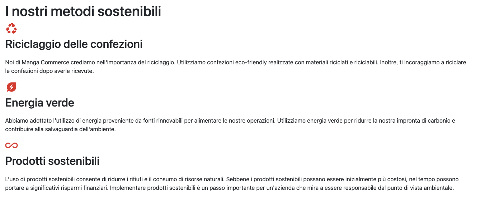
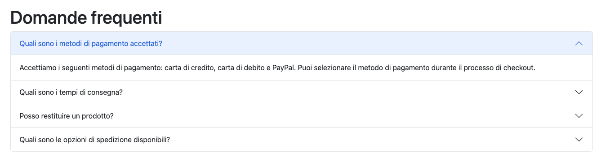
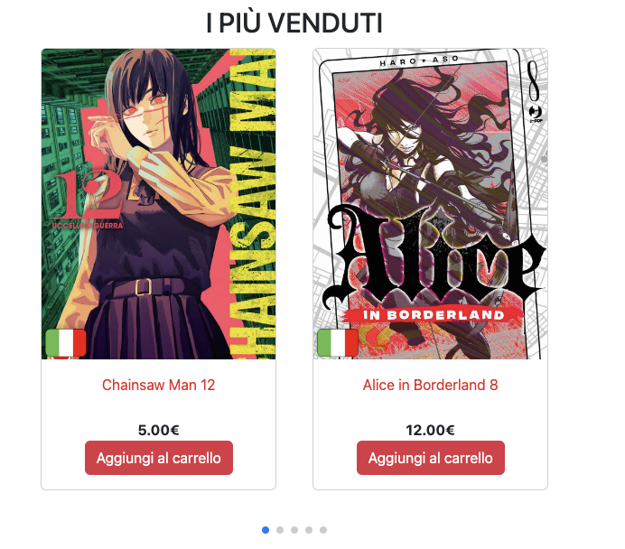
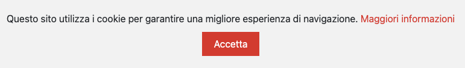

# Progetto d'esame
## Manga Commerce
**Alessia Colpo** n° _matricola:823_
Graphic Design
ACME - 3°anno
A.A. 2023-2024
**Materia**:Web Design 2
**Docente**:Matteo Baccan

---


Quest'anno abbiamo creato un **sito multi pagina per un e-commerce**. Io ho scelto di progettare un e-commerce di manga, utilizzando le **competenze** acquisite in precedenza su **HTML, CSS e Javascript**.

Il repository è pubblicato a questo indirizzo: https://mangacommerce.netlify.app/

---
# Creazione Slide

Marp conosciuto anche come _Markdown Presentation Ecosystem_ permette un'esperienza intuitiva e veloce per creare delle semplici slide. Quello che noi dobbiamo fare è semplicemente scrivere un documento in **markdown**.

---
# Strumento per la programmazione

Ho usato il _code editor_ **Visual Studio Code**, clonando il mio repository di GitHub localmente, potendo **programmare** tranquillamente **offline** e successivamente aggiornare il mio repository di GitHub

---
# Librerie
js
bootstrap
google material icons

---
# IA e Chat GPT

Ho usato questa IA, _intelligenza artificiale_ per **creare** in parte il **codice** e aiutarmi quando non sapevo come realizzarlo, inoltre mi è stata utile anche per **creare parte dei testi** all'interno del sito

---
## Esempi di pagine generate da Chat GPT:


---

**N.B:** ogni elemento è stato revisionato e adattato dalla sottoscritta.

---

# Creazione del sito
---
## Homepage

In alto abbiamo la **navbar** importante per la navigazione all'interno del sito.
Caratteristica rilevante sono gli slider, realizzati usando delle demo di [Swiper](https://swiperjs.com/demos)

---
### Primo Slider:

Il carosello iniziale prevede un **autoplay** con un intervallo di tempo specifico
e la possibilità di fare swipe e vedere le altre diapositive.

---
### Secondo Slider

I prodotti nella home sono resi **dinamici** grazia a una funzione **JS** che cicla attraverso un **array di prodotti** e **genera del codice HTML** per ogni prodotto, che viene quindi inserito all'interno di un elemento specifico nel documento HTML.

---
#### Array:
```js
let products = [
  {
    id: 1,
    nome: "Chainsaw Man 12",
    prezzo: 5.0,
    immagine: "immagini/shounen/cm12.jpg",
    categoria: "shounen",
    descrizione: "...",
  },
  ...
]
```
Per far funzionare il tutto ho dovuto creare questa **variabile contenente i vari prodotti** che poi appaiono nella pagina

---
#### Funzione JS che definisce la struttura HTML:
```js
html = "";
products.forEach((product) => {
    html += `
<div class="swiper-slide img">

...

</div>`;
});
document.getElementById("dinamicihome").innerHTML = html;
```
Secondo il codice JS il codice html verrà generato nell'elemento **"dinamicihome"**, un semplice <div> presente nella pagina index.html

---
## Funzioni globali
- Cookie
- Scroll To Top
- Barra di Ricerca
---
### Cookie
Ogni sito al giorno d'oggi ha l’obbligo di informare gli utenti sulla raccolta e l’elaborazione dei dati. Anche se un sito web non trae profitto direttamente o sostanzialmente dall’elaborazione dei dati, se vengono raccolti dati personali utilizzando i cookie, **è necessario in ogni modo una cookie policy**.



---
#### Codice HTML
```html
<div id="cookie-banner" class="cookie-banner">
    <p> ... <a href="cookie.html">Maggiori informazioni</a></p>
    <button id="cookie-accept">Accetta</button>
</div>
```
Per accedere alla cookie policy completa basta cliccare su **Maggiori informazioni** e si verrà portati nella pagina **cookie.html**
#### Funzione JS:
```js
document.addEventListener("DOMContentLoaded", function () {
    var cookieBanner = document.getElementById("cookie-banner");
    var cookieAccept = document.getElementById("cookie-accept");
```
Questa parte di codice ottiene i riferimenti agli elementi HTML del banner dei cookie e li assegna a delle variabili.

---
#### Gestore di eventi e funzione di callback:
```js
    cookieAccept.addEventListener("click", function () {
        cookieBanner.style.display = "none";
        localStorage.setItem("cookieConsent", "true");
    });
```
Si aggiunge un gestore di eventi al clic sull'elemento cookieAccept, così quando l'utente fa clicca, viene eseguita una **funzione di callback**. All'interno di questa funzione, viene **impostato lo stile** dell'elemento cookieBanner su **"none"**, che lo **nasconde**.
Viene poi utilizzato l'oggetto **localStorage** per impostare un valore booleano "true" con la chiave "cookieConsent". Questo indica che l'utente ha accettato i cookie.

---
```js
    if (!localStorage.getItem("cookieConsent")) {
        cookieBanner.style.display = "block";
    }
});
```
Successivamente, si verifica se l'utente ha già accettato i cookie, se nel localStorage è **presente** un **valore associato alla chiave "cookieConsent"**. Se non è presente, viene impostato lo stile dell'elemento cookieBanner su "block", che lo rende visibile. 

---

### Scroll To Top
Permette all'utente di ritornare all'inzio della pagina comodamente, elemento fondamentale parlando di **UX**, specialmente in situazioni in cui il contenuto web è prolisso e l'utente ha bisogno di tornare alla navbar per cambiare pagina.

---
#### Scroll To Top HTML
```html
<div onclick="scrollToTop()" class="top">
    
</div>
```
**Onclick** indica l'evento con il quale, al **click** dell'utente sull'**immagine della freccia**, si **attiva una funzione**.

---
#### Funzione JS
```js
function scrollToTop() {
  window.scrollTo(0, 0);
}
```
La funzione che si attiva utilizza il metodo **scrollToTop()** che fa scorrere la finestra (**oggetto window**) del browser verso l'inizio impostando i valori delle coordinate a 0.

---

#### From Footer to Top
Affianco ho messo il mockup a dimostrazione del funzionamento della funzione **scrollToTop()**

---

### Barra di Ricerca
La barra di ricerca è funzionante e risponde a tutti i prodotti presenti nell'array globale, facendo visulizzare il risultato nella pagina prodotti.html

---

La barra di ricerca è inglobata all'interno della **navbar**. Visivamente volevo che inizialmente ci fosse solamente l'icona di una lente d'ingradimento e che dopo aver cliccato su di essa apparisse la barra di ricerca effettiva.
#### Codice HTML, selector ID e CLASS
```html
<form id="search-form">
    <div>
        <i class="material-icons search-icon" id="search-icon">search</i>
        <input class="search-input" type="search" placeholder="Search">
    </div>
</form>
```
---
#### Evento sull'icona di ricerca
```js
searchIcon.addEventListener("click", function () {
    if (searchInput.classList.contains("show-search-input")) {
        searchInput.classList.remove("show-search-input");
    } 
```
Questo blocco di codice aggiunge un gestore di eventi al clic sull'elemento con l'**ID "search-icon"**. Quando l'utente fa **clic sull'icona di ricerca**, viene eseguita una **funzione di callback**.
In questo caso si verficia se l'elemento **searchInput** ha attiva la classe CSS **"show-search-input"** ed è quindi già visibile, allora all'**evento di clic** la **classe "show-search-input" viene rimossa** dall'elemento searchInput, quindi il **campo di input di ricerca viene nascosto**.

---
```js
    else 
    {
        searchInput.classList.add("show-search-input");
        searchInput.focus();
    }
});
```
Altrimenti se l'elemento **searchInput non ha la classe "show-search-input"**, il campo input di ricerca non è visibile e in questo caso, viene **aggiunta la classe "show-search-input" all'elemento searchInput**. Inoltre, viene utilizzato il **metodo focus()** su searchInput, consentendo all'utente di iniziare subito a digitare nel campo di input.

---


#### Evento al tasto Invio
```js
searchInput.addEventListener("keypress", function (e) {
    if (e.key == "Enter") {
        e.preventDefault();
        if (searchInput.value == "") return;
        window.location.href = `prodotti.html?s=${searchInput.value}`;
    }
});
```
Con questo codice quando l'utente preme il tasto "Invio" nell'input di ricerca, viene eseguita una **funzione di callback.**
La funzione verifica se il tasto premuto è "Enter" e se il valore dell'input di ricerca è vuoto, la funzione viene interrotta. Altrimenti, viene effettuato un **reindirizzamento** alla pagina **"prodotti.html"**.

---

## Chi siamo
In questa pagina vi è semplicemente una breve descrizione dell'e-commerce e delle figure che compongono il team.

---

### Team Card
All'interno di queste card vengono presentate le figure del team di Manga Fun. Usando un **:hover selector** cambio il CSS delle card facendole ingrandire.
```css
.team-card:hover {
    transform: scale(1.1);
  }
```

---

## Contatti
In questa pagina ho inserito gli **estremi di contatto** e ho incluso un **form** per permettere alle persone di **contattarci direttamente dalla pagina**.

---
### Checkbox
```js
document.querySelector("form").addEventListener("submit", function (event) {
    var checkbox = document.getElementById("myCheck");
    if (!checkbox.checked) {
        event.preventDefault(); // Previene l'invio del modulo
        var errorSpan = document.querySelector(".checkbox-error");
        errorSpan.style.display = "block"; // Mostra il messaggio di avviso
    }
});
```
Questo primo blocco di codice gestisce l'evento di invio del modulo del form. Se una casella di controllo specifica non è selezionata, impedisce l'invio del modulo e mostra un messaggio di errore corrispondente.

---
### Messaggio di conferma
```js
if (document.getElementById("contact-form") != null) {
    document.getElementById("contact-form").addEventListener("submit", function (event) {
        event.preventDefault(); // Previeni l'invio del modulo
        var checkboxChecked = document.getElementById("myCheck").checked;

        if (checkboxChecked) {
            // Nascondi il modulo di contatto
            document.getElementById("contact-form").style.display = "none";

            // Mostra il messaggio di conferma
            document.getElementById("confirmation-message").style.display = "block";
        }
    });
}
```
Il secondo blocco di codice gestisce sia l'evento di invio del modulo e quando una casella di controllo specifica è selezionata, nasconde il modulo di contatto e mostra un messaggio di conferma di invio del messaggio.

---
## Prodotti
La pagina dei prodotti come nella home è resa **dinamica attraverso un array di prodotti** e **generando del codice HTML per ogni prodotto**, che viene quindi inserito all'interno di un elemento specifico nel documento HTML.
Inoltre è presente un **filtro dei prodotti** in base a:
- Categoria
- Intervallo di prezzo selezionati

---
#### Gestione del filtro
```js
if (document.getElementById("priceRange") != null) {
  var priceRange = document.getElementById("priceRange");
  var priceDisplay = document.getElementById("priceDisplay");

  priceRange.oninput = function () {
    priceDisplay.innerHTML = "€" + priceRange.value;
  };
}
```
---
```js
function filterProducts() {
  var selectedCategory = document.getElementById("categoryDropdown").value;
  var priceRangeValue = document.getElementById("priceRange").value;
// prodotti dinamici
  let html = "";
  products.forEach((product) => {
    console.log(selectedCategory);
    if (
      product.prezzo <= parseInt(priceRangeValue) &&
      (product.categoria == selectedCategory || selectedCategory == "tutti")
    ) {
      html += `
      <div class="col col-sm-12 col-md-6 col-lg-4 d-flex justify-content-center">
        <div class="product ${product.categoria}" data-price="${product.prezzo}">
          
          <div>
            <a class="nome" href="prodotto.html?p=${product.nome}">
              <p class="nome">${product.nome}</p>
            </a>
            <b>${product.prezzo.toFixed(2)}€</b>
            <br>
            <a class="btn btn-primary">Aggiungi al carrello</a>
          </div>
        </div>
      </div>`;
    }
  })

  document.getElementById("rigacontenitore").innerHTML = html;
}
```
---
## Carrello
---
#### Calcolo importo
```js
function calculateTotal() {
    var priceElement = document.querySelector(".card-text.price");
    var quantityElement = document.querySelector(".form-control.quantity");
    var subtotalElement = document.getElementById("subtotal");
    var shippingCostElement = document.getElementById("shippingCost");
    var totalAmountElement = document.getElementById("totalAmount");

    if (priceElement && quantityElement && subtotalElement && shippingCostElement && totalAmountElement) {
        var priceString = priceElement.textContent;
        var price = parseFloat(priceString.replace("Prezzo: ", "").replace("€", "").replace(",", "."));
        var quantity = parseInt(quantityElement.value);
        var total = price * quantity;

        var totalElement = quantityElement.parentNode.nextElementSibling;
        totalElement.textContent = "Totale: €" + total.toFixed(2);

        subtotalElement.textContent = "€" + total.toFixed(2);

        var shippingCost = 2.0; // Inserisci il valore effettivo dei costi di spedizione
        shippingCostElement.textContent = "€" + shippingCost.toFixed(2);

        var totalAmount = total + shippingCost;
        totalAmountElement.textContent = "€" + totalAmount.toFixed(2);
    }
}
```
La funzione `calculateTotal()` viene utilizzata per calcolare il totale dell'importo in base al prezzo e alla quantità di un prodotto selezionato.

---
#### Rimozione del prodotto
```js
function removeProduct(event) {
    var card = event.target.closest(".card");
    card.remove();

    var subtotalElement = document.getElementById("subtotal");
    var shippingCostElement = document.getElementById("shippingCost");
    var totalAmountElement = document.getElementById("totalAmount");

    if (subtotalElement && shippingCostElement && totalAmountElement) {
        subtotalElement.innerHTML = "€0,00";
        shippingCostElement.innerHTML = "€0,00";
        totalAmountElement.innerHTML = "€0,00";
    }
}
```
La funzione `removeProduct(event)` viene utilizzata per rimuovere un prodotto dalla lista e reimpostando a zero i valori

---
## Responsive mockup


---
## Analisi [GTmetrix](https://swiperjs.com/demos)


---
# Grazie per l'attenzione
Alessia Colpo


