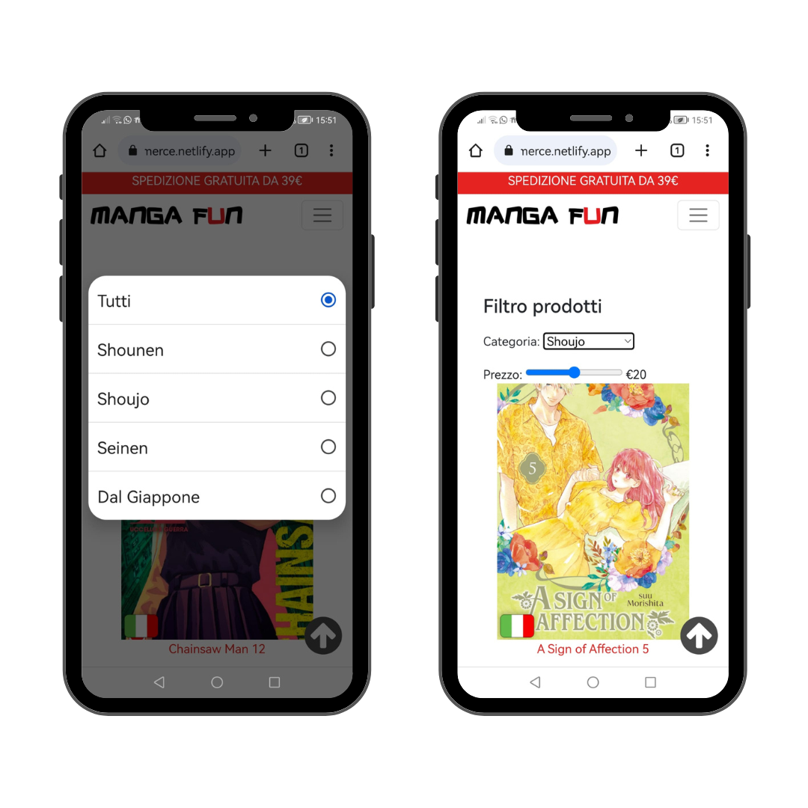
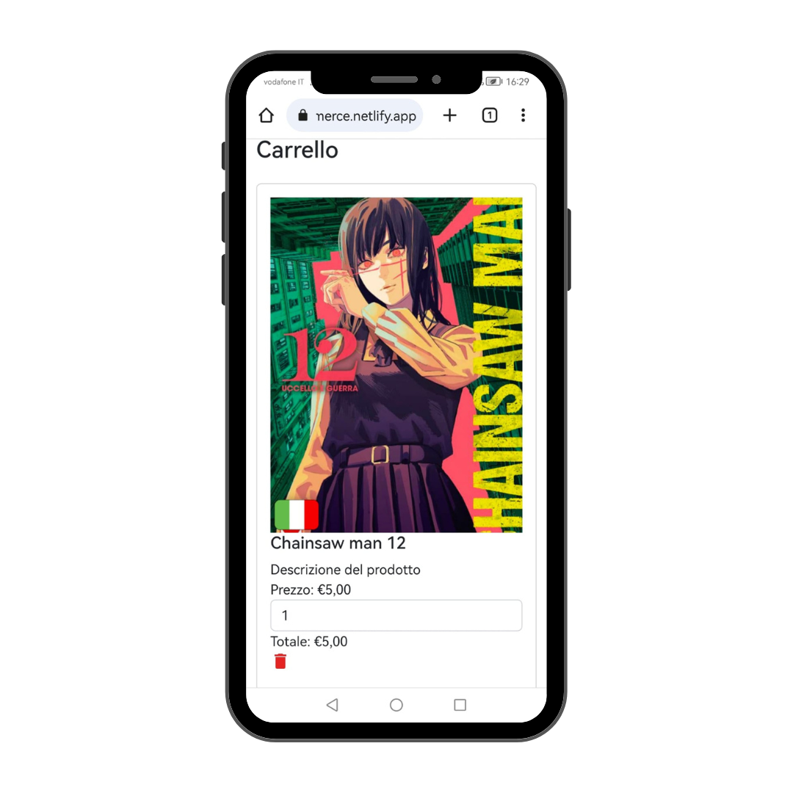
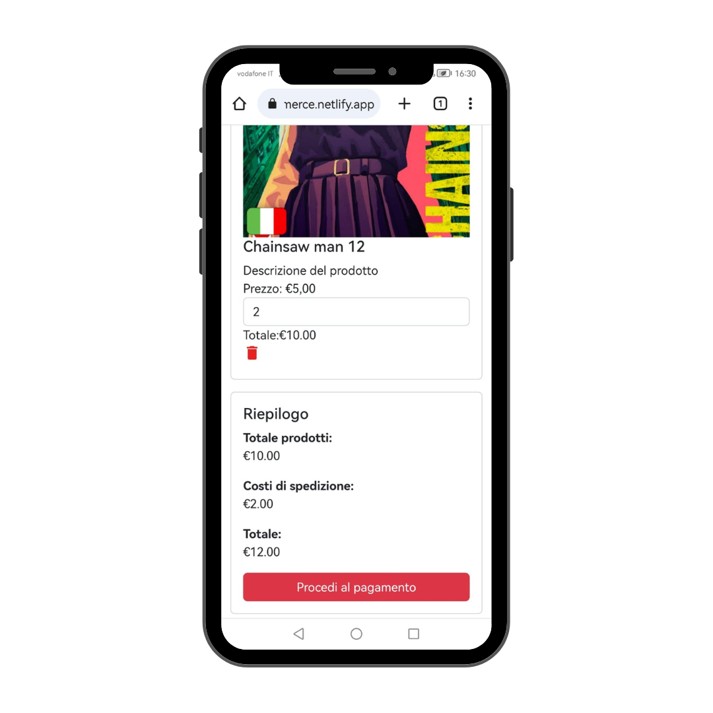

# Progetto d'esame
## Manga Commerce
**Alessia Colpo** n° _matricola:823_
Graphic Design
ACME - 3°anno
A.A. 2023-2024
**Materia**:Web Design 2
**Docente**:Matteo Baccan

---


Quest'anno abbiamo creato un **sito multi pagina per un e-commerce**. Io ho scelto di progettare un e-commerce di manga, utilizzando le **competenze** acquisite in precedenza su **HTML, CSS e Javascript**.

Il repository è pubblicato a questo indirizzo: https://mangacommerce.netlify.app/

---
# Creazione Slide

Marp conosciuto anche come _Markdown Presentation Ecosystem_ permette un'esperienza intuitiva e veloce per creare delle semplici slide. Quello che noi dobbiamo fare è semplicemente scrivere un documento in **markdown**.

---
# Strumento per la programmazione

Ho usato il _code editor_ **Visual Studio Code**, clonando il mio repository di GitHub localmente, potendo **programmare** tranquillamente **offline** e successivamente aggiornare il mio repository di GitHub

---

# Librerie
## Bootstrap
**Bootstrap** è una libreria di **strumenti liberi per la creazione di siti e applicazioni per il Web**. Essa contiene modelli di progettazione basati su HTML e CSS, sia per la tipografia, che per le varie componenti dell'interfaccia, come moduli, pulsanti e navigazione, così come alcune estensioni opzionali di JavaScript.

---

## Google Material Icons
All’interno del sito ho deciso di utilizzare le Material Icons di Google, in questo modo non ho dovuto preoccuparmi più di tanto della risoluzione.
Le Material Icons inoltre si comportano come un font pertanto a livello di CSS vengono utilizzate le stesse proprietà.

---
# IA e Chat GPT

Ho usato questa IA, _intelligenza artificiale_ per **creare** in parte il **codice** e aiutarmi quando non sapevo come realizzarlo, inoltre mi è stata utile anche per **creare parte dei testi** all'interno del sito.

---
## Esempi di pagine generate da Chat GPT:


---

**N.B:** ogni elemento è stato revisionato e adattato dalla sottoscritta.

---

# Creazione del sito
---
## Struttura
Il sito è composto da 5 pagine principali: 
- Home
- Chi siamo
- Contatti
- Prodotti
- Carrello

Ogni pagina presenta degli elementi di base come la **navbar** e il **footer**

---
## Homepage

In alto abbiamo la **navbar** importante per la navigazione all'interno del sito.
Caratteristica rilevante sono gli slider, realizzati usando delle demo di [Swiper](https://swiperjs.com/demos)

---
### Primo Slider:

Il carosello iniziale prevede un **autoplay** con un intervallo di tempo specifico
e la possibilità di fare swipe e vedere le altre diapositive.

---
### Secondo Slider

I prodotti nella home sono resi **dinamici** grazia a una funzione **JS** che cicla attraverso un **array di prodotti** e **genera del codice HTML** per ogni prodotto, che viene quindi inserito all'interno di un elemento specifico nel documento HTML.

---
#### Array:
```js
let products = [
  {
    id: 1,
    nome: "Chainsaw Man 12",
    prezzo: 5.0,
    immagine: "immagini/shounen/cm12.jpg",
    categoria: "shounen",
    descrizione: "...",
  },
  ...
]
```
Per far funzionare il tutto ho dovuto creare questa **variabile contenente i vari prodotti** che poi appaiono nella pagina

---
#### Funzione JS che definisce la struttura HTML:
```js
html = "";
products.forEach((product) => {
    html += `
<div class="swiper-slide img">

...

</div>`;
});
document.getElementById("dinamicihome").innerHTML = html;
```
Secondo il codice JS il codice html verrà generato nell'elemento **"dinamicihome"**, un semplice <div> presente nella pagina index.html

---
## Funzioni globali
- Cookie
- Scroll To Top
- Barra di Ricerca
---
### Cookie
Ogni sito al giorno d'oggi ha l’obbligo di informare gli utenti sulla raccolta e l’elaborazione dei dati. Anche se un sito web non trae profitto direttamente o sostanzialmente dall’elaborazione dei dati, se vengono raccolti dati personali utilizzando i cookie, **è necessario in ogni modo una cookie policy**.


---
#### Codice HTML
```html
<div id="cookie-banner" class="cookie-banner">
    <p> ... <a href="cookie.html">Maggiori informazioni</a></p>
    <button id="cookie-accept">Accetta</button>
</div>
```
Per accedere alla cookie policy completa basta cliccare su **Maggiori informazioni** e si verrà portati nella pagina **cookie.html**

---
#### Funzione JS:
```js
    cookieAccept.addEventListener("click", function () {
        cookieBanner.style.display = "none";
        localStorage.setItem("cookieConsent", "true");
    });
```
Si aggiunge un gestore di eventi al clic sull'elemento cookieAccept, così quando l'utente fa clicca, viene eseguita una **funzione di callback**. All'interno di questa funzione, viene **impostato lo stile** dell'elemento cookieBanner su **"none"**, che lo **nasconde**.
Viene poi utilizzato l'oggetto **localStorage** per impostare un valore booleano "true" con la chiave "cookieConsent". Questo indica che l'utente ha accettato i cookie.

---
```js
    if (!localStorage.getItem("cookieConsent")) {
        cookieBanner.style.display = "block";
    }
});
```
Successivamente, si verifica se l'utente ha già accettato i cookie, se nel localStorage è **presente** un **valore associato alla chiave "cookieConsent"**. Se non è presente, viene impostato lo stile dell'elemento cookieBanner su "block", che lo rende visibile.

---

### Scroll To Top
Permette all'utente di ritornare all'inzio della pagina comodamente, elemento fondamentale parlando di **UX**, specialmente in situazioni in cui il contenuto web è prolisso e l'utente ha bisogno di tornare alla navbar per cambiare pagina.

---
#### Scroll To Top HTML
```html
<div onclick="scrollToTop()" class="top">
    
</div>
```
**Onclick** indica l'evento con il quale, al **click** dell'utente sull'**immagine della freccia**, si **attiva una funzione**.

---
#### Funzione JS
```js
function scrollToTop() {
  window.scrollTo(0, 0);
}
```
La funzione che si attiva utilizza il metodo **scrollToTop()** che fa scorrere la finestra (**oggetto window**) del browser verso l'inizio impostando i valori delle coordinate a 0.

---

#### From Footer to Top
Affianco ho messo il mockup a dimostrazione del funzionamento della funzione **scrollToTop()**

---

### Barra di Ricerca
La barra di ricerca è funzionante e risponde a tutti i prodotti presenti nell'array globale, facendo visulizzare il risultato nella pagina prodotti.html

---

La barra di ricerca è inglobata all'interno della **navbar**. Visivamente volevo che inizialmente ci fosse solamente l'icona di una lente d'ingradimento e che dopo aver cliccato su di essa apparisse la barra di ricerca effettiva.
#### Codice HTML, selector ID e CLASS
```html
<form id="search-form">
    <div>
        <i class="material-icons search-icon" id="search-icon">search</i>
        <input class="search-input" type="search" placeholder="Search">
    </div>
</form>
```
---
#### Evento sull'icona di ricerca
```js
searchIcon.addEventListener("click", function () {
    if (searchInput.classList.contains("show-search-input")) {
        searchInput.classList.remove("show-search-input");
    }
```
Questo blocco di codice aggiunge un gestore di eventi al clic sull'elemento con l'**ID "search-icon"**. Quando l'utente fa **clic sull'icona di ricerca**, viene eseguita una **funzione di callback**.
In questo caso si verficia se l'elemento **searchInput** ha attiva la classe CSS **"show-search-input"** ed è quindi già visibile, allora all'**evento di clic** la **classe "show-search-input" viene rimossa** dall'elemento searchInput, quindi il **campo di input di ricerca viene nascosto**.

---
```js
    else
    {
        searchInput.classList.add("show-search-input");
        searchInput.focus();
    }
});
```
Altrimenti se l'elemento **searchInput non ha la classe "show-search-input"**, il campo input di ricerca non è visibile e in questo caso, viene **aggiunta la classe "show-search-input" all'elemento searchInput**. Inoltre, viene utilizzato il **metodo focus()** su searchInput, consentendo all'utente di iniziare subito a digitare nel campo di input.

---


#### Evento al tasto Invio
```js
searchInput.addEventListener("keypress", function (e) {
    if (e.key == "Enter") {
        e.preventDefault();
        if (searchInput.value == "") return;
        window.location.href = `prodotti.html?s=${searchInput.value}`;
    }
});
```
Con questo codice quando l'utente preme il tasto "Invio" nell'input di ricerca, viene eseguita una **funzione di callback.**
La funzione verifica se il tasto premuto è "Enter" e se il valore dell'input di ricerca è vuoto, la funzione viene interrotta. Altrimenti, viene effettuato un **reindirizzamento** alla pagina **"prodotti.html"**.

---

## Chi siamo
In questa pagina vi è semplicemente una breve descrizione dell'e-commerce e delle figure che compongono il team.

---

### Team Card
All'interno di queste card vengono presentate le figure del team di Manga Fun. Usando un **:hover selector** cambio il CSS delle card facendole ingrandire.
```css
.team-card:hover {
    transform: scale(1.1);
  }
```

---

## Contatti
In questa pagina ho inserito gli **estremi di contatto** e ho incluso un **form** per permettere alle persone di **contattarci direttamente dalla pagina**.

---

### Invio modulo e Checkbox
```js
function handleFormSubmit(event) {
  event.preventDefault();
  var checkboxChecked = document.getElementById("myCheck").checked;
```
Questo primo blocco di codice **impedisce il comportamento predefinito dell'evento di submit del modulo** e seleziona l'elemento con l'**ID "myCheck"** accedendo alla proprietà checked del suddetto per capire se la casella di controllo è selezionata o meno. 

---
### Messaggio di conferma
```js
  if (checkboxChecked) {
    // Nascondi il modulo di contatto
    document.getElementById("contact-form").style.display = "none";

    // Mostra il messaggio di conferma
    document.getElementById("confirmation-message").style.display = "block";
  }
}
```
Questa parte di codice verrà **eseguita solo se la casella di controllo è selezionata**.
Se è selezionata il contact-form verrà nascosto (display="none") e verrà mostrato l'elemento con ID "confirmation-message" cambiando il suo diplay da **none** a **block**

---

## Prodotti
La pagina dei prodotti come nella home è resa **dinamica attraverso un array di prodotti** che permette di **generare codice HTML per ogni prodotto**, inserito all'interno di un elemento specifico (determinato da un ID) nel documento HTML.
Inoltre è presente un **filtro dei prodotti** in base a:
- Categoria
- Intervallo di prezzo selezionati

---
#### Filtro prodotti
```js
function filterProducts() {
...
// prodotti dinamici
  let html = "";
  products.forEach((product) =>
```
Questa parte contiene la funzione filterProducts, che viene chiamata per filtrare i prodotti in base alla categoria e all'intervallo di prezzo. Viene creato un **ciclo forEach** per iterare attraverso ogni prodotto nell'array products.

---

## Prodotto Singolo
La **generazione** di questa pagina è resa **dinamica** utilizzando l'array con i prodotti

---

## Carrello
La pagina del carrello non è completamente funzionante, al momento non è possibile aggiungere i prodotti al suo interno ma è stata realizzata per dare un'idea di come dovrebbe essere effettivamente.

---
### Calcolo importo
La funzione `calculateTotal()` viene utilizzata per calcolare il totale dell'importo in base al prezzo e alla quantità di un prodotto selezionato.
```js
function calculateTotal() {
    var priceElement = document.querySelector(".card-text.price");
    var quantityElement = document.querySelector("form-control.quantity");
    var subtotalElement = document.getElementById("subtotal");
    var shippingCostElement = document.getElementById("shippingCost");
    var totalAmountElement = document.getElementById("totalAmount");
    if (priceElement && quantityElement && subtotalElement && shippingCostElement && totalAmountElement)
    ...
```
Inizialmente controlla se tutti gli elementi necessari sono presenti sulla pagina.

---

Se tutti gli elementi sono presenti:
- Ottiene il **prezzo del prodotto** dalla stringa **priceElement** assegnandolo alla variabile **price**
- Ottiene la **quantità** del prodotto dal **campo di input in quantityElement**.
- Calcola il **totale moltiplicando il prezzo per la quantità** e assegna il risultato alla **variabile total**.
```js
 var total = price * quantity;
 ```
---

A questo punto:
- Aggiorna il contenuto dei vari elementi HTML con i prezzi finali.
- Si imposta il costo di spedizione
- Calcola l'**importo totale** sommando il **totale del prodotto al costo di spedizione** e assegna il risultato alla **variabile totalAmount**.

---

#### Rimozione del prodotto
```js
function removeProduct(event) {
    var card = event.target.closest(".card");
    card.remove();

    var subtotalElement = document.getElementById("subtotal");
    var shippingCostElement = document.getElementById("shippingCost");
    var totalAmountElement = document.getElementById("totalAmount");

    if (subtotalElement && shippingCostElement && totalAmountElement) {
        subtotalElement.innerHTML = "€0,00";
        shippingCostElement.innerHTML = "€0,00";
        totalAmountElement.innerHTML = "€0,00";
    }
}
```
La funzione `removeProduct(event)` viene utilizzata per rimuovere il prodotto dal carrello reimpostando a zero i valori dei vari elementi html.

---
## Responsive mockup


---
## Analisi [GTmetrix](https://gtmetrix.com/)


---
## Analisi [SEOptimer](https://www.seoptimer.com/)


---

# Grazie per l'attenzione
Alessia Colpo
